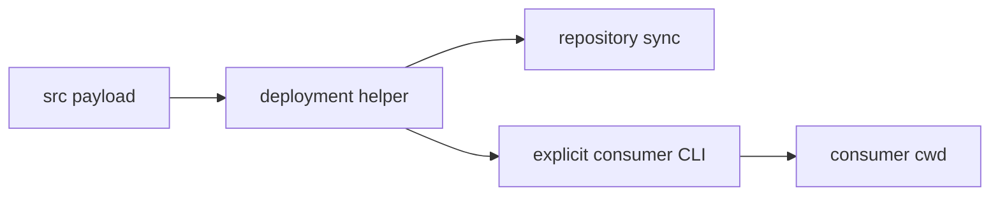

# PLAN-20260903-01: Implement GitHub Packages distribution

Last modified: 2026-09-03
Status: In progress

## Objective

Implement v0.5.0 and [SPEC-20260903-01](../specs/SPEC-20260903-01.md) as a
full `src/` template package with explicit init/update lifecycle commands,
without postinstall side effects, while preserving existing synchronization
commands.

## Current-state findings

- The root package was private and its first distribution shape excluded the
  reusable seed/template content.
- `scripts/sync-roundhouse.js` already copied and cleaned the deployed workflow.
- Root `.opencode/` and `opencode.json` are generated from `src/`.

## Intended shape

The shared helper owns copying, stale cleanup, missing-only copying, and
dry-run reporting. The repository wrapper preserves root-only artifacts; the
package CLI uses non-destructive init and managed-overwrite update.
The consuming repository's `.opencode/` is package-owned and is not a supported
customization surface; consumers fork to customize it. Seed/template files
outside `.opencode/` remain create-only after initialization.

## Work packages

### WP-01: Package and deployment

- Add publishable metadata and CLI (Required).
- Reuse deployment logic from repository synchronization (Required).
- Add package and lifecycle coverage for package contents, init/update policies,
  stale managed files, newly added seeds, and dry-run (Required).

### WP-02: Release and documentation

- Add tag-validated least-privilege publication workflow with separate
  validation and publication jobs (Required).
- Document full-template contents, docs/template distinction, authentication,
  overwrite/update behavior, forks, v0.5.0, release tags, and the manual GitHub
  tag-protection/release-environment settings (Required).
- Add and index this specification and plan (Required).

## Change map

| File | Action | Purpose |
| --- | --- | --- |
| `package.json` | Modify | Publish metadata and commands |
| `package/roundhouse.js` | Create | Published explicit deployment CLI |
| `package/deploy-roundhouse.js` | Create | Published shared deployment implementation |
| `scripts/sync-roundhouse.js` | Modify | Reuse shared implementation |
| `scripts/test-package.js` | Create | Repository-only package/deployment smoke tests |
| `.github/workflows/publish.yml` | Create | Tag-driven publication |
| `README.md` | Modify | Consumer and release documentation |

## Verification criteria

- `npm pack --dry-run` and an actual tarball contain only the allowlisted
  `package/`, complete `src/`, root `README.md` and `LICENSE` metadata, and
  npm's required `package.json`; root README is present in the tarball but is
  not part of the `src/` deployment payload. Root docs, references,
  guiding-principles, and maintenance scripts are excluded.
- Smoke tests prove package contents, fresh/non-destructive init, managed and seed update behavior, stale removal, and non-mutating dry-run.
- Security tests reject source and nested destination links; the packed-artifact
  test installs the npm tarball in isolation and runs init, update, and dry-run.
- The broad `v*` trigger is retained intentionally; strict validation fails
  invalid v-prefixed tags before publication.
- Validation has only contents read permission; publication alone has contents
  read and packages write, receives the package token only at the publish step,
  and depends on successful validation. GitHub `v*` tag protection and any
  release-environment approval are manual repository settings, not workflow
  configuration.
- Package lifecycle hooks are absent, and pack/publish operations use
  `--ignore-scripts`.
- A file at the managed `.opencode` root is rejected before mutation; unrelated
  consumer-tree links are not inspected.
- `npm run test-sync` and `docs-check` pass.
